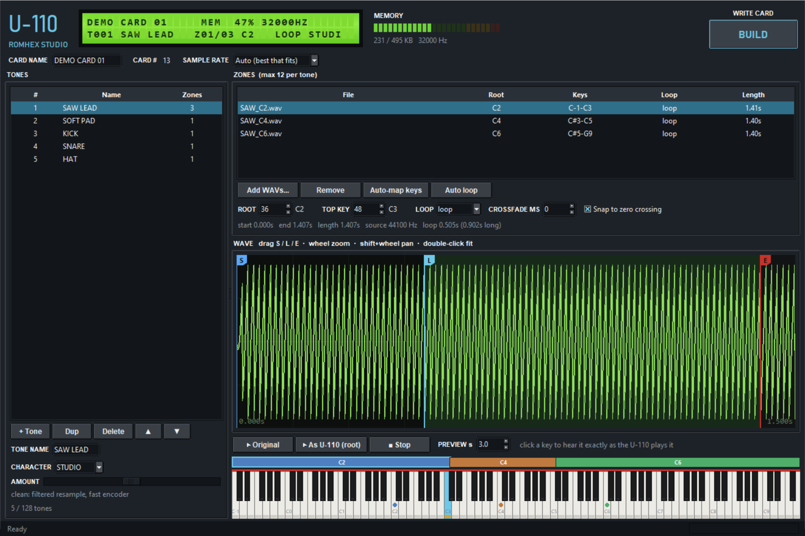
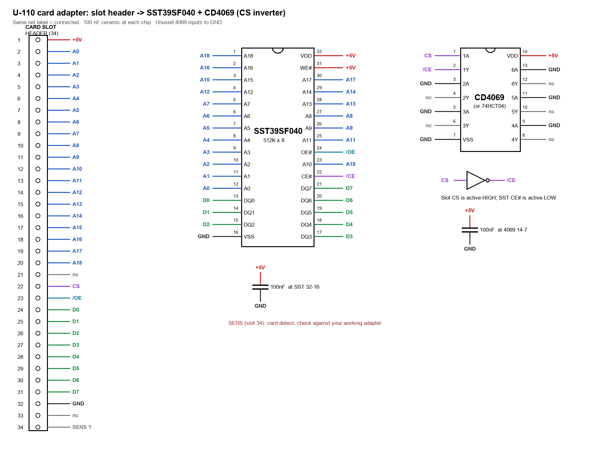

# U110 RomHex Studio  (WIP)

Make your own **PCM sample cards for the Roland U-110** (and the other machines that read SN-U110 cards:
U-20, U-220, D-70, CM-32P, CM-64, MV-30, Rhodes 660/760). This is a free, open replacement for the custom-card
tools that never shipped.

> **Made by JunkSmithWizard (JSW) together with Claude (Anthropic's AI).** Claude wrote the code and did the format analysis
> (descrambling, sample coding, tables). JSW built the hardware, burned and tested every card on a real U-110,
> and made the debugging calls that cracked it: the known-good D-70 ROM control and the CD4069 noise fix.
> Reverse-engineered and shipped in one day.

Drop in WAV files, set root notes, key ranges and loops, press **Build**. You get a 512 KB image to burn on a
flash chip (e.g. SST39SF040) sitting in a card-slot adapter. Tested on a real U-110: custom multisampled,
looping and one-shot tones play correctly.

## Demo

**[Listen: u110_demo.mp3](docs/demo/u110_demo.mp3)** (1:42, recorded from a real U-110 playing a custom card)

> **⚠ AUDIO WARNING: turn your volume down first.** This demo has loud, harsh, glitchy digital sounds.

- **0:00: three samples:** custom multisampled tones from a card built with this tool.
- **Then: wavetable:** single-cycle waves and scan-morph tones (Tone → Wavetable). The stepped scan plus the
  U-110's 8-bit delta coding gives a tunable, glitchy "pleasant malfunction" sound.

## Burn cards with an ESP32

Don't have a chip programmer? An **ESP32-S3** can write the card chip itself, over USB or from a web page, for a
few dollars in parts: **[esp32-maskrom-programmer](https://github.com/yuyoi/esp32-maskrom-programmer)** (a working prototype). It wrote
a full 512 KB card image with 0 wrong bytes, no level shifters or resistors on the breadboard.

In the app: **File → Build and Burn to Programmer** (Ctrl+Shift+B) builds the card and sends it straight to the
programmer over USB; **File → Send .bin to Programmer...** sends any 512 KB image. Take the chip out of the synth first.

## Screenshots

*Styled after the U-110's front panel: backlit LCD, memory LEDs, a waveform editor with start/loop/end markers,
and colour-coded key zones on the keyboard. Click a key to hear it exactly as the U-110 will play it.*

pin 34 ties HIGH to 5V+

*The card-slot adapter used for testing: slot header to SST39SF040, with a CD4069 inverting the active-high card
select.*

## Quick start (Windows)

1. Run **`U110RomHexStudio.exe`**. No install is needed. The exe is unsigned, so Windows may show "Windows
   protected your PC": click **More info > Run anyway**. It takes a few seconds to start.
   Or, from source: install Python 3.10+, run `pip install -r src/requirements.txt`, then `run_from_source.bat`.
2. **File > Open Project** and pick `examples/demo.u110proj` to see a finished card, or start fresh:
   - **+ Tone**, then **Add WAVs**. Several files at once become either one multisampled tone (key zones) or
     one tone per file (drums, FX).
   - Root notes are read from file names (`Piano_C3.wav`, `F#2`, `60`) or from the WAV's own sampler chunk.
     Loop points saved in the WAV (Wavosaur, Audacity, Awave, ...) are used.
   - Waveform: drag **S** (start), **L** (loop start), **E** (end). Wheel zooms, Shift+wheel pans.
     **Auto loop** finds a loop and crossfades it.
   - Click the on-screen keyboard to hear a key **exactly as the U-110 will play it**: the real 8-bit
     encoding, playback rate and loop behaviour.
3. **Build Card...** writes `NAME_BURN.bin` plus a report. Burn it as-is (no byte swap).
4. On the U-110, go to EDIT > PATCH > PART > BAS and change the tone group from `I` to the slot holding the
   card. Insert and remove cards with the power off.

## Character modes (per tone)

| Mode | Sound | Memory |
|---|---|---|
| **STUDIO** | clean, filtered resample | 100% |
| **CRYSTAL** | look-ahead encoder, slightly cleaner, slower build | 100% |
| **DUSTBOX** | SP-style lo-fi: ~26 kHz, no anti-alias filter, drive | ~88% |
| **8-BIT** | early 8-bit sampler: 256 steps, 22-16 kHz, no filter | ~70% |
| **CHIPTUNE** | retro game: 6-4 bit, 16-8 kHz, sample & hold | ~50% or less |

**Amount** sets drive, rate or crush. Playback is always 12-bit, because that's what the U-110's sound chip outputs.

## Limits (set by the card format)

| | |
|---|---|
| Card size | 512 KB, about 496 KB for audio (~15 s at the native 32 kHz) |
| Tones | 128 per card |
| Key zones | 12 per tone |
| One sample | max 64 KB: 2 s at 32 kHz. Longer samples are automatically stored at a lower rate and stay in tune |
| Resolution | 12-bit, stored as 8-bit companded DPCM (Roland's "RS-PCM") |

When a card is too full, **Sample rate: Auto** lowers the whole card in semitone steps until it fits.
The memory bar shows how much is used.

## Also in the box

- **File > Import card .bin**: open any SN-U110 card image (a Roland dump or one of your own) to edit it,
  and extract its samples as WAVs.
- `src/u110card.py` on the command line: `info`, `wavs` (extract samples) and `convert` (MAME card dump to
  burnable connector order).
- `docs/FORMAT.md`: the reverse-engineered card format.
- `docs/HARDWARE.md` + `docs/adapter_schematic.png`: card-slot pinout, adapter wiring and the byte-order pitfall.

## Important: byte order

Images from MAME's `sn-u110-xx.bin` set have address lines **A8..A15 reversed** compared with the card slot.
Burned as-is on a straight-wired adapter, they load with garbled names and no sound. This app always writes
**connector order**, the right order for a straight adapter. `u110card.py convert` fixes MAME dumps.

## Status: work in progress 🚧

This is an early release. It works, and it's tested on a real U-110, but expect rough edges and changes.

**Planned:**
- **A reprogrammable card:** an RP2040 (or similar) on a custom PCB, either as a card or fitted inside the
  unit, so you can load new sounds over USB without pulling and burning chips.
- Dual-layer, velocity-switch and drum-kit tone types.
- Confirmed support on the U-20, U-220 and D-70.

Ideas, bug reports and test results are very welcome. Open an issue.

## Legal

Not affiliated with or endorsed by Roland Corporation. "Roland", "U-110" and "SN-U110" are trademarks of
Roland Corporation. This package contains **no Roland data**: the demo sounds were synthesized for it. Only
share cards containing sounds you have the rights to. Format knowledge builds on MAME's open-source Roland
drivers (BSD-3-Clause) and the U-110 service notes.

License: MIT (see `LICENSE`).

---

**Thanks for enjoying, and God bless you!** — JSW
