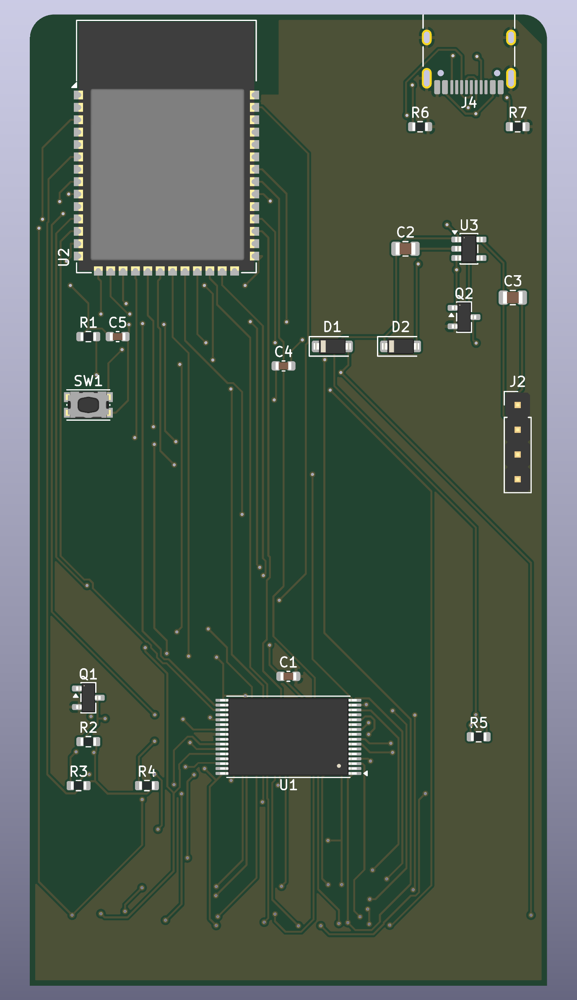

# Hex Wizard MK2 card (KiCad 10): proposed prototype, UNTESTED

**Status: proposed prototype. Nothing here has been fabricated, assembled or tested.** The footprints, power switching and firmware are unverified (the finger order follows a working clone card and the long GND finger is confirmed). Check against a real U-110 card before ordering boards.

A Roland U-110 / SN-U110 ROM card that carries its own **SST39SF040 flash** and an **ESP32-S3** (WiFi/USB), so the card can be re-burned without a programmer.

| Board | What it is | State |
|---|---|---|
| [`mk2_min/`](mk2_min) | The minimum-parts card: 23 parts, SST39SF040 (TSOP-32) + ESP32-S3-WROOM-1-N16, USB-C. | Schematic + fully routed 2-layer PCB (GND pour), KiCad DRC: 0 unconnected, no clearance errors |
| [`mk2_vero/`](mk2_vero) | No components: all 34 fingers traced to labeled 2.54 mm holes at the back of the card plus a blank perf field. Single sided, made for a hobby mill. | PCB only, DRC clean apart from the expected finger edge-clearance |

Previews: [`img/`](img). BOM: [`mk2_min/BOM.csv`](mk2_min/BOM.csv).

## mk2_min: how it works
- ESP GPIOs go **straight to the SST bus** (A0..A18, D0..D7, WE#). No buffers or series resistors, to keep the part count minimal.
- The slot's CS is **active HIGH**; one 2N7002 (Q1) inverts it into the SST's CE#.
- Pull-ups on CS, /OE and WE# mean a card that is out of the synth has CE# low, OE# high and WE# high, which is what a burn needs.
- Two Schottky diodes OR the slot 5 V and USB 5 V into the 5 V rail; an AP2112K makes 3.3 V.
- Q2 (N-FET in the ESP ground leg, gate on the 5 V rail) switches the ESP on by itself when the card is inserted or USB is plugged in.
- USB-C is the ESP's native USB. BOOT/user button on IO0, 4-pin header for a 0.96 in I2C OLED.

### Parts (BOM)
| Qty | Refs | Part |
|---|---|---|
| 1 | U1 | SST39SF040-70-4C-TU, 512 KB flash, 8 x 14 mm TSOP-32 |
| 1 | U2 | ESP32-S3-WROOM-1-N16 (not an octal-PSRAM R8 part) |
| 1 | U3 | AP2112K-3.3 LDO |
| 2 | Q1, Q2 | 2N7002 (SOT-23); Q2 may need an AO3400 if the ESP browns out |
| 2 | D1, D2 | SS14W Schottky (SOD-123) |
| 1 | J4 | USB-C 16-pin receptacle (HRO TYPE-C-31-M-12 footprint) |
| 1 | SW1 | SMD tact switch (KMR2 style) |
| 1 | J2 | 1x4 pin header (OLED) |
| 2 | C2, C3 | 10 uF 0805 |
| 3 | C1, C4, C5 | 100 nF x2, 1 uF x1 (0603) |
| 8 | R1-R7 | 10 k x2, 100 k x3, 5.1 k x2 (0603) |
| 1 | J1 | card-edge fingers (on the PCB) |

### GPIO map (the firmware has NOT been ported to this)
A0..A18 = 18, 8, 9, 10, 11, 12, 13, 14, 21, 35, 36, 37, 38, 39, 40, 41, 42, 47, 48; D0..D7 = 1, 2, 4, 5, 6, 7, 15, 16; WE# = 17; OLED SDA/SCL = 3/46; BOOT/user button = 0; USB D-/D+ = 19/20. IO45 is left alone (high at boot can select 1.8 V flash).

## Known caveats and risks
- **Finger order** comes from the working clone card's Gerber (all 34 fingers on the bottom copper, long GND finger = pin 32, third from one end, then pin 33 open and pin 34 SENS; pin 1 at the far end, on the right seen from the top with the card edge down) and the long finger being GND is confirmed on a real card. Card pins 21 and 33 are left open (function unknown); pin 34 SENS is tied to +5 V on the original. Still worth a continuity check on a real card before ordering.
- **The synth's 5 V reaches the ESP pins** whenever the card is in the synth, and the ESP now powers up there too (Q2 closes on the slot 5 V). That can damage the ESP; there is no isolation by design.
- Q2 is a 2N7002 (about 2-3 ohm on-resistance); swap for an AO3400 if WiFi bursts brown the ESP out.
- The card outline (53 x 99.5 mm) was measured from a clone card, not a Roland spec; slot height limits and card thickness are unknown, and the fingers need a bevelled edge and a hard-gold or ENIG finish.
- The TSOP footprint is the 8 x 14 mm package; change `SST_FP` in `gen/mk2_min_gen.py` for the 8 x 20 mm one.
- Fine-pitch TSOP and 96 vias make `mk2_min` a fab job, not a mill job.
- The card-edge footprint ([`SN-U110_CardEdge.pretty`](SN-U110_CardEdge.pretty)) is an original drawing from measured contact positions (pitch, width, length); no third-party artwork or routing is included.

## Regenerating
`gen/mk2_min_gen.py` / `gen/mk2_vero_gen.py` rebuild the projects (KiCad 10 must be installed for its libraries). Regenerating `mk2_min` produces the **unrouted** board; `gen/fr_scratch.py` plus a Freerouting 2.4 jar and Java 25 reproduce the autoroute (GND routed as copper, then a solid GND pour). `gen/verify.py mk2_min` checks schematic and PCB nets agree.

